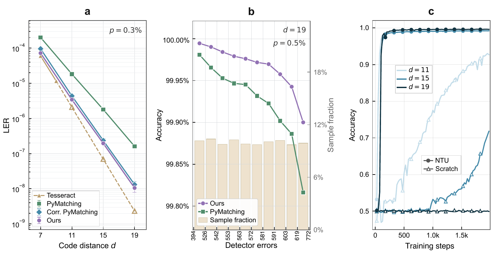

## 为什么开博客

做科研的过程中，我发现自己"以为懂了"和"真的能讲清楚"之间隔着一条鸿沟。费曼说过，如果不能把一个概念讲给大一学生听，说明你自己也没真正理解它。这个博客就是我给自己设的费曼测试：把量子纠错、机器学习以及两者交叉领域里的东西，用我自己的话写一遍。

以后的文章大概分三类：

- **研究笔记** —— 读论文、做项目的思考，比如 Surface Code 解码器、量子线路编译
- **技术教程** —— 把踩过的坑整理成能复现的步骤
- **杂谈** —— 竞赛、生活，以及一些不成熟的想法

## 顺便测一下渲染效果

### 行内公式

量子比特的状态可以写成 $|\psi\rangle = \alpha|0\rangle + \beta|1\rangle$，其中 $|\alpha|^2 + |\beta|^2 = 1$。有了 `\ket` 宏之后，写起来会更简洁：$\ket{\psi} = \alpha\ket{0} + \beta\ket{1}$。

### 展示公式

Surface Code 的码距 $d$ 与逻辑错误率 $p_L$ 之间近似满足指数压制关系：

$$
p_L \approx A \left( \frac{p}{p_{\text{th}}} \right)^{\frac{d+1}{2}}
$$

多行推导用 `align` 环境也没问题：

$$
\begin{aligned}
\mathcal{L}(\theta) &= -\log P_\theta(\hat{y} = y \mid s) \\
&= -\sum_{i} y_i \log \sigma(f_\theta(s_i)) \\
&\quad + \lambda \lVert \theta \rVert_2^2
\end{aligned}
$$

### 代码块

训练解码器时的典型循环长这样：

```python
def train_step(model, batch, optimizer):
    syndrome, label = batch
    logits = model(synergy_features(syndrome))
    loss = F.cross_entropy(logits, label)
    optimizer.zero_grad()
    loss.backward()
    optimizer.step()
    return loss.item()
```

### 图片

配图直接用 Markdown 语法插入：



## 更新频率

不立 flag，随缘更新。但下一期的主题已经想好了：**为什么神经解码器在小距离码上训练得很好，一到大距离码就"冷启动"失败** —— 这正是我们 NTU 工作要解决的问题。

感谢阅读，欢迎通过主页上的邮箱交流。
