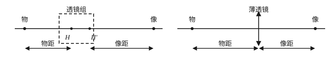
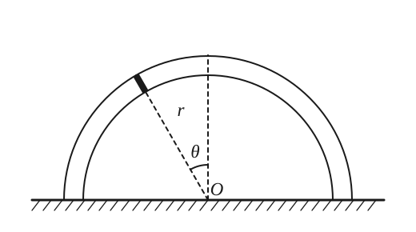
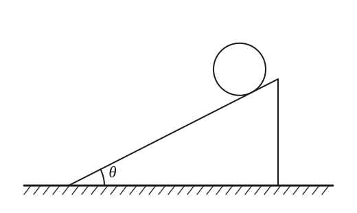
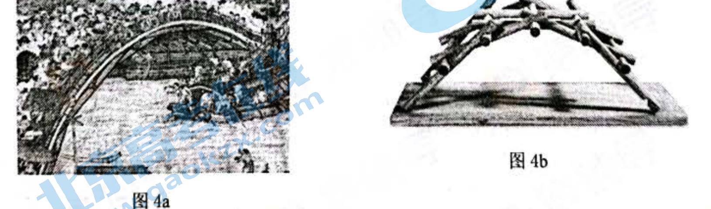
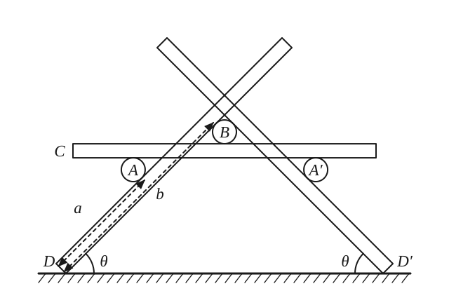
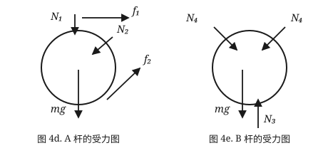

## 写在前面

这个博客大概是用来记录我自己想写的东西的——研究笔记、做题的思考、或者仅仅是某天突然想明白的一件小事。

最近一年一度的物理复赛又要来了。作为两年前从赛场上走下来的人，难免想回忆一下自己考复赛是什么感觉。于是我翻出了自己当年考的**第 40 届全国中学生物理竞赛复赛**（2023 年 9 月 16 日）的试卷和参考解答，作为博客的第一篇正式内容，把当时的题目完整解析一遍。

我参加的是**第二次复赛**（第一次的故事以后有机会再讲）。这一届的试卷共 **8 道题、320 分、考试时间 3 小时**，内容覆盖光学、热学、力学、结构平衡、电磁感应、大气声学和 X 射线物理。本文先完整解析**前四题**，后四题留到下一篇。

> 说明：题目文字按当年试卷重新录入，解答参考官方解答重新排版整理；每道题后面有一段「**我的回忆**」，是我留给自己的空白，想到什么就补什么。

---

## 一、（40 分）手机透镜组的主点与等效焦距

### 题目

利用智能手机的相机可以进行光学实验。手机的镜头是一个由许多元件组成的系统，这些镜头元件被封装后只有几毫米厚，因此可以安装在厚度不到一厘米的手机中。相机的图像传感器以像素为单位记录所拍摄的物体的像，借助软件可以读取像的实际尺寸。在以下问题中，将手机镜头视为结构固定的共轴理想透镜组，可以证明其物像关系等效于一个凸透镜，可以利用薄透镜成像公式进行有关计算。与薄透镜不同的是，需要在光轴上确定一对参考点 H、H'（称为主点）作为计算物距、像距、焦距的起点，如图 1a 所示。本题所有成像光路都满足近轴条件。

（1）物体通过镜头成像时，由于透镜组封装在手机内部，在镜头结构与参数未知的情况下无法直接确定主点位置，因而无法直接用尺子测量物距 $u$ 的具体数值。实验中，可以沿光轴前后移动与光轴垂直、长度为 $l$ 的刻度尺，使其在物距为 $u_1$ 和 $u_2$ 的两个位置分别成像，测量出刻度尺移动的距离 $s = u_2 - u_1$ 和对应像的长度大小 $l_1$、$l_2$。求：

（i）该镜头的等效焦距 $F$（用测得的 $l$、$l_1$、$l_2$ 和 $s$ 表示）；

（ii）物距 $u_1$（用测得的 $l$、$l_1$、$l_2$ 和 $s$ 表示）。

（2）若透镜组由两个焦距分别为 $f_1$ 和 $f_2$ 的共轴薄凸透镜 1 和 2 组成，它们的光心分别为 $O_1$ 和 $O_2$，间距为 $d$。物（实或虚）的光依次通过透镜 1 和 2 成像时，透镜组存在横向放大率为 $+1$ 的一对物面和像面（称为主平面），它们与光轴的交点分别称为物方主点 H 和像方主点 H'。

（i）将 H 看作透镜 1 的"物"，求 H 相对于 $O_1$ 的物距；将 H' 看作透镜 2 的"像"，求 H' 相对于 $O_2$ 的像距。

（ii）透镜组成像时，物距、物方焦距从物方主点 H 算起，像距、像方焦距从像方主点 H' 算起，求物方焦距 $F$ 和像方焦距 $F'$。

### 解答

**(1)(i)** 设刻度尺在物距 $u_1$ 处成像的像距为 $v_1$，对等效凸透镜用成像公式：

$$\frac{1}{u_1} + \frac{1}{v_1} = \frac{1}{F}$$

由横向放大关系（像长与物长之比）：

$$\frac{v_1}{u_1} = \frac{l_1}{l} \;\Longrightarrow\; u_1 = F\left(1 + \frac{l}{l_1}\right)$$

同理，物距 $u_2$ 的位置满足 $u_2 = F\left(1 + \dfrac{l}{l_2}\right)$。两式相减：

$$s = u_2 - u_1 = F\left(\frac{l}{l_2} - \frac{l}{l_1}\right)
\;\Longrightarrow\;
\boxed{F = \frac{s\, l_1 l_2}{l\,(l_1 - l_2)}}$$

**(1)(ii)** 把 $F$ 代回 $u_1$ 的表达式：

$$\boxed{u_1 = \frac{s\, l_2\,(l_1 + l)}{l\,(l_1 - l_2)}}$$

**(2)(i)** 设透镜 1 的物距、像距为 $u_1$、$v_1$，透镜 2 的物距、像距为 $u_2$、$v_2$，分别满足：

$$\frac{1}{u_1} + \frac{1}{v_1} = \frac{1}{f_1}, \qquad \frac{1}{u_2} + \frac{1}{v_2} = \frac{1}{f_2}$$

两镜的（带符号）横向放大率为 $m_1 = -v_1/u_1$、$m_2 = -v_2/u_2$，即 $\dfrac{1}{m_1} = 1 - \dfrac{u_1}{f_1}$、$\dfrac{1}{m_2} = 1 - \dfrac{u_2}{f_2}$。总放大率 $m = m_1 m_2$，故：

$$\frac{1}{m} = \left(1 - \frac{u_1}{f_1}\right)\left(1 - \frac{u_2}{f_2}\right)$$

主平面处 $m = +1$。又透镜 1 的像成为透镜 2 的物，两光心距离为 $d$，即 $u_2 = d - v_1$，而 $v_1 = \dfrac{u_1 f_1}{u_1 - f_1}$。联立解出主点 H 相对于 $O_1$ 的物距：

$$u_H = \frac{f_1 d}{d - f_1 - f_2}$$

由光路可逆（或对称地把 H' 看作透镜 2 的"像"），H' 相对于 $O_2$ 的像距：

$$v_{H'} = \frac{f_2 d}{d - f_1 - f_2}$$

**(2)(ii)** 物距为无穷大（平行光入射）时，经透镜组成像的位置即像方焦点，此时 $u_1 = \infty$，$v_1 = f_1$，$u_2 = d - f_1$。代入透镜 2 成像公式得 $v_{F'} = v_2 = \dfrac{(d-f_1)f_2}{d - f_1 - f_2}$。像方焦距从 H' 算起：

$$F' = v_{F'} - v_{H'} = \frac{-f_1 f_2}{d - f_1 - f_2},\qquad \text{即 } \frac{1}{F'} = \frac{1}{f_1} + \frac{1}{f_2} - \frac{d}{f_1 f_2}$$

由光路可逆，物方焦距 $F = F'$。

> **我的回忆**
>
> （待补：第一次见到"主点"这个概念时的感受；实验题里刻度尺前后移动的数据处理；当时这一问做到什么程度……）

---

## 二、（40 分）半圆玻璃管中的活塞

### 题目

如图 2a，将一个粗细均匀、两端封闭的细玻璃管弯成半径为 $r$ 的半圆环（玻璃管的横截面半径远小于 $r$），竖直固定于水平地面上，两端面与地面接触。玻璃管内有一个质量为 $m$ 的活塞（金属片），活塞与管内壁紧密接触，两者之间的摩擦可忽略不计。活塞在半圆环内相对于竖直方向的位置记为 $\theta$。活塞两边管内各有 $n$ 摩尔的理想气体，且其温度始终与外界温度 $T$（绝对温度）相同。已知重力加速度大小为 $g$，普适气体常量为 $R$，所有涉及的气体状态变化的过程均可视为准静态过程。

（1）当温度 $T$ 高于某临界温度 $T_c$ 时，玻璃管的正中央（$\theta = 0$）是活塞的稳定平衡位置。求临界温度 $T_c$ 的表达式，并计算活塞在该平衡位置附近做微振动的圆频率；

（2）当温度 $T = T_c$ 时，分析并判断活塞在玻璃管正中央时平衡的稳定性。解答如下几问时，可将 $T_c$ 看作为已知参量，不必代入（1）中的结果；

（3）当 $T < T_c$ 时，求活塞的稳定平衡位置与竖直方向的夹角 $\theta_0$ 所满足的方程，并给出温度略小于 $T_c$ 时 $\theta_0$ 的近似表达式（保留至非零的最低阶）；

（4）当 $T < T_c$ 时，求活塞在稳定平衡位置附近做微振动的圆频率 $\omega_0$ 对 $\theta_0$ 的依赖关系 $\omega_0(\theta_0)$（表达式中可含有上一问中的 $\theta_0$ 参量，但不可包含 $T$ 参量），并给出温度 $T$ 略小于 $T_c$ 和略小于 $T_c$ 两种情况下，活塞微振动的圆频率对温度的依赖关系；

（5）当 $T < T_c$ 时，假设活塞的初始速度近似为零，求活塞从正中央运动到可到达的角位置 $\theta$ 处的角速度大小。

### 解答

设活塞偏离正中央的角度为 $\theta$。两侧气柱长度分别为 $r(\pi/2 - \theta)$ 和 $r(\pi/2 + \theta)$，由理想气体状态方程（等温），两侧压强为 $p = nRT / V$。活塞沿管切向的运动方程为：

$$mr\frac{\mathrm{d}^2\theta}{\mathrm{d}t^2} = mg\sin\theta - \frac{nRT}{r(\pi/2 - \theta)} + \frac{nRT}{r(\pi/2 + \theta)}$$

**(1)** 当 $|\theta| \ll 1$ 时展开（$\sin\theta \approx \theta$，$1/(\pi/2 \mp \theta) \approx \dfrac{2}{\pi}\left(1 \pm \dfrac{4\theta}{\pi^2} + \dfrac{16\theta^2}{\pi^4}\right)$，保留到一阶）：

$$\frac{\mathrm{d}^2\theta}{\mathrm{d}t^2} = -\frac{1}{r}\left(g - \frac{8nRT}{\pi^2 r m}\right)\theta$$

正中央稳定要求回复系数为正，即 $g - \dfrac{8nRT}{\pi^2 r m} < 0$，所以临界温度：

$$\boxed{T_c = \frac{\pi^2 m g r}{8 n R}}$$

此时活塞做简谐振动，圆频率：

$$\omega = \sqrt{\frac{1}{r}\left(\frac{8nRT}{\pi^2 r m} - g\right)} = \sqrt{\frac{g}{r}\cdot\frac{T - T_c}{T_c}}$$

**(2)** $T = T_c$ 时保留到三阶，运动方程化为：

$$\frac{\mathrm{d}^2\theta}{\mathrm{d}t^2} = -\frac{24 + \pi^2}{6\pi^2}\cdot\frac{g}{r}\,\theta^3$$

活塞受到正比于 $\theta^3$ 的恢复力，所以正中央仍是**稳定**平衡位置（不是简谐振动）。

**(3)** $T < T_c$ 时，设稳定平衡位置在 $\theta_0 \neq 0$ 处，该处合力为零：

$$mg\sin\theta_0 - \frac{nRT}{r(\pi/2 - \theta_0)} + \frac{nRT}{r(\pi/2 + \theta_0)} = 0$$

整理得 $\theta_0$ 满足的方程：

$$\frac{2nRT}{mgr} = \left(\frac{\pi^2}{4} - \theta_0^2\right)\frac{\sin\theta_0}{\theta_0}$$

右端 $f(\theta_0) = \left(\dfrac{\pi^2}{4} - \theta_0^2\right)\dfrac{\sin\theta_0}{\theta_0}$ 在 $\theta_0 \in (0, \pi/2)$ 上单调递减，$\theta_0 \to 0$ 时取最大值 $\pi^2/4$。所以方程有非零解的条件正是 $T < T_c$。当 $T$ 略小于 $T_c$ 时 $\theta_0 \approx 0$，把 $T/T_c = \left(1 - \dfrac{4\theta_0^2}{\pi^2}\right)\dfrac{\sin\theta_0}{\theta_0}$ 展开得：

$$\theta_0 = \pm\sqrt{\frac{6\pi^2}{24 + \pi^2}\cdot\frac{T_c - T}{T_c}}$$

（正负号表示平衡位置可以在左右两侧。）

**(4)** 在 $\theta_0 + \theta$（$|\theta| \ll 1$）处给活塞微扰，微振动方程为：

$$\frac{\mathrm{d}^2\theta}{\mathrm{d}t^2} = -\frac{g\cos\theta_0}{r}\left[1 - \frac{\tan\theta_0}{\theta_0}\cdot\frac{\pi^2/2 + 2\theta_0^2}{\pi^2/2 - 2\theta_0^2}\right]\theta$$

所以：

$$\omega_0(\theta_0) = \sqrt{\frac{g\cos\theta_0}{r}\left[\frac{\tan\theta_0}{\theta_0}\cdot\frac{\pi^2/2 + 2\theta_0^2}{\pi^2/2 - 2\theta_0^2} - 1\right]}$$

温度略高于 $T_c$ 时（用 (1) 的结果）：

$$\omega = \sqrt{\frac{g}{r}\left(\frac{8nRT}{\pi^2 m r} - 1\right)} = \sqrt{\frac{g}{r}\cdot\frac{T - T_c}{T_c}}$$

温度略低于 $T_c$ 时（$\theta_0 \ll 1$，代入 (3) 的近似）：

$$\omega_0 \approx \sqrt{\frac{2g}{r}\cdot\frac{24 + \pi^2}{3\pi^2}\cdot\frac{T_c - T}{T_c}}$$

**(5)** 运动方程两边乘 $\mathrm{d}\theta$ 并从正中央积分（初速度为零）：

$$\frac{1}{2}mr\dot{\theta}^2 = mg(1 - \cos\theta) + \frac{nRT}{r}\ln\left(1 - \frac{4\theta^2}{\pi^2}\right)$$

于是活塞到达角位置 $\theta$ 处的角速度大小：

$$\boxed{|\dot{\theta}| = \sqrt{\frac{2g}{r}(1 - \cos\theta) + \frac{2nRT}{m r^2}\ln\left(1 - \frac{4\theta^2}{\pi^2}\right)}}$$

> **我的回忆**
>
> （待补：当年热学题做到第几问；对"稳定性要用三阶项判断"这个套路的印象……）

---

## 三、（40 分）楔块上的匀质圆球

### 题目

如图 3a，倾角为 $\theta$、质量为 $M$ 的三角形楔块放在光滑的水平地面上，其斜面上有一个质量为 $m$、半径为 $r$ 的匀质圆球，让该球从静止开始自由向下运动，整个过程中楔块无转动。重力加速度大小为 $g$，假设圆球与楔块之间的静摩擦因数和滑动摩擦因数均为 $\mu$。

（1）若 $\mu$ 足够大，使得球无滑动地滚下，求：

（i）楔块相对于地面的加速度的大小 $a_0$；

（ii）匀质圆球质心相对于楔块的加速度的大小 $a_c$；

（iii）地面对楔块的支持力的大小 $N$；

（iv）楔块对圆球的支持力的大小 $N_1$；

（v）为了使匀质圆球保持无滑动，球与楔块之间静摩擦因数 $\mu$ 的最小可能值 $\mu_0$。

（2）若 $\mu$ 小于（1）(v) 问中的 $\mu_0$，且楔块斜面足够长，求圆球从静止开始运动一段时间 $\Delta t$ 后，圆球上与楔块接触的点 P 相对于楔块的速度。

### 解答

**(1)(i)** 球无滑动滚下时，过球质心与楔块质心的竖直面与斜面垂直，只需考虑平面内运动。设楔块加速度为 $a_0$（水平），球质心相对楔块的加速度为 $a_c$（沿斜面），摩擦力为 $f$。球在地面参考系中，沿斜面方向的质心运动方程与绕质心的转动方程分别为：

$$ma_c = ma_0\cos\theta + mg\sin\theta - f, \qquad f\, r = I_c\ddot{\varphi}$$

纯滚动条件 $a_c = r\ddot{\varphi}$，且匀质球 $I_c = \dfrac{2}{5}mr^2$，得 $f = \dfrac{2}{5}ma_c$。地面系中系统水平方向动量守恒（求导）：

$$m(a_c\cos\theta - a_0) = M a_0$$

联立解得：

$$\boxed{a_0 = \dfrac{\dfrac{5}{7}mg\sin\theta\cos\theta}{M + m - \dfrac{5}{7}m\cos^2\theta}}$$

**(1)(ii)** 将 $a_0$ 代回解出球质心相对楔块的加速度：

$$\boxed{a_c = \dfrac{\dfrac{5}{7}(M + m)g\sin\theta}{M + m - \dfrac{5}{7}m\cos^2\theta}}$$

**(1)(iii)** 把楔块和球看作整体，质心竖直方向加速度 $a_y = \dfrac{-m a_c\sin\theta}{M + m}$，由质心运动定理：

$$\boxed{N = (M + m)g\,\dfrac{M + \dfrac{2}{7}m}{M + m - \dfrac{5}{7}m\cos^2\theta}}$$

（也可将楔块单独作为研究对象，用球对楔块的压力与摩擦力求出同样结果。）

**(1)(iv)** 在相对楔块静止的参考系中，垂直斜面方向上球受力平衡（含惯性力分量）：

$$\boxed{N_1 = mg\cos\theta\,\dfrac{M + \dfrac{2}{7}m}{M + m - \dfrac{5}{7}m\cos^2\theta}}$$

**(1)(v)** 纯滚动要求 $f \le \mu N_1$，其中 $f = \dfrac{2}{5}ma_c$：

$$\boxed{\mu_0 = \frac{f}{N_1} = \frac{2(M + m)}{7M + 2m}\tan\theta}$$

**(2)** $\mu < \mu_0$ 时球连滚带滑。此时 $f = \mu N_1$，球质心动力学方程仍由上式给出，联立解得：

$$a_c = \frac{(M + m)g(\sin\theta - \mu\cos\theta)}{M + m - m\cos^2\theta - \mu m\sin\theta\cos\theta}$$

$a_c$、角加速度 $\ddot{\varphi} = \dfrac{5f}{2mr}$ 均为常量。接触点 P 相对楔块的速度为质心滑动速度与转动线速度之差：

$$\boxed{v_P = \frac{(M + m)g\sin\theta - \mu\left(m + \dfrac{7}{2}M\right)g\cos\theta}{M + m - m\cos^2\theta - \mu m\sin\theta\cos\theta}\,\Delta t}$$

可检验 $\mu = \mu_0$ 时 $v_P = 0$（纯滚动）；$\mu < \mu_0$ 时 $v_P > 0$，P 点相对楔块斜向下滑。

> **我的回忆**
>
> （待补：当年这道题是纯滚动还是连滚带滑的判断有没有犹豫；动量守恒和质心运动定理的选择……）

---

## 四、（40 分）编木拱桥的平衡

### 题目

北宋著名画家张择端所绘的《清明上河图》中有一座用木材制作的"编木拱桥"（图 4a），形成一道飞虹架设在河上。四百多年后达·芬奇也曾留下类似的设计手稿，至今为世人称奇。图 4b 是五个单元组成的编木拱桥实物模型，每个单元包含一对与纸面平行的长杆和一根垂直于纸面的短杆，它没有钉也没有卯，整个结构的所有组件在重力作用下互相挤压而结合在一起，靠支持力和摩擦力互相支撑，互相制约。真实桥梁需要在木材上开槽，以提升桥的安全性。

考虑一个简化的编木拱桥模型，即仅有三个单元的左右对称的拱桥，图 4c 是其侧视图。在简化模型下，只考虑拱桥在竖直平面（纸面）内的平衡，将与纸面平行的每一对长杆等效为一根质量为 $M$ 的杆，则此编木拱桥可进一步简化为六根杆：三根短杆 A、A'、B 和三根长杆 C、D、D'。所有的杆都是半径为 $R$ 的匀质圆柱体，没有开槽。短杆的质量均为 $m$，长杆的长度均为 $L$，长杆之间互不接触。短杆 B 表面是光滑的，其余杆之间的静摩擦因数均为 $\mu$，杆与地面间的静摩擦因数为 $\mu'$。长杆 D、D' 与水平地面的夹角均为 $\theta$。重力加速度大小为 $g$。

（1）已知图 4c 中 D 杆下端到与 A 杆的接触点之间的长度为 $a$，求 D 杆下端到与 B 杆的接触点之间的长度 $b$ 的表达式。

（2）系统平衡时，考虑到杆 A 与 A' 对称，杆 D 与 D' 对称，分析图 4c 中 A、B、C、D 四根杆的受力情况。图 4d、4e 分别给出了 A、B 两根杆的受力，请画出图 4c 中 C、D 两根杆的受力图，为简明起见，每一对作用力和反作用力请用同一符号表示。对 A、B、C、D 四根杆分别列出相应的力平衡方程（必要时包括力矩平衡方程）。

（3）设 $M = 6m$，$\theta = 45°$，$L = 30\ \mathrm{cm}$，$a = 16\ \mathrm{cm}$，$R = 2(\sqrt{2}-1)\ \mathrm{cm}$，试求静摩擦因数 $\mu$ 和 $\mu'$ 满足什么数值条件时，图 4c 所示的结构能保持平衡（数值结果保留三位有效数字）？

### 解答

**(1)** 由接触点的几何关系：

$$\boxed{b = a + 4R\cot\frac{\theta}{2}}$$

**(2)** C、D 两杆的受力图：C 杆受两端来自 A、A' 的支持力 $N_1$（两处）、自身重力 $Mg$、来自 B 的压力 $N_3$，以及 A、A' 与 C 之间的静摩擦力 $f_1$（两处）；D 杆受地面支持力 $N_5$ 与摩擦力 $f_5$、来自 B 的压力 $N_4$ 与摩擦 $f_2$、来自 A 的支持力 $N_2$ 与摩擦 $f_2$（同一对作用力）、自身重力 $Mg$。

各杆的平衡方程（ $f_1$ 为 A、C 间摩擦力，$f_2$ 为 A、D 与 B、D 间的摩擦力，$N_2$ 为 A、D 间压力，$N_4$ 为 B、D 间压力）：

$$\text{A 杆：}\quad N_1 + mg = N_2\cos\theta + f_2\sin\theta$$
$$f_1 + f_2\cos\theta = N_2\sin\theta$$

对 A 杆圆柱轴线的力矩平衡：$f_1 R = f_2 R$，即 $f_1 = f_2$。

$$\text{B 杆：}\quad N_3 = 2N_4\cos\theta + mg$$
$$\text{C 杆：}\quad 2N_1 = N_3 + Mg$$
$$\text{D 杆（竖直与水平方向）：}\quad N_5 + N_4\cos\theta = N_2\cos\theta + f_2\sin\theta + Mg$$
$$f_5 + N_2\sin\theta = N_4\sin\theta + f_2\cos\theta$$

对 D 杆与地面接触点的力矩平衡：

$$N_2 a + Mg\left(\frac{L}{2}\cos\theta - R\sin\theta\right) = N_4 b + f_2\cdot 2R$$

（也可对 D 杆质心列力矩方程，结果等价。）

**(3)** 此条件下 $b = a + 4R\cot\dfrac{\theta}{2} = 24\ \mathrm{cm}$。

由 A 杆的方程可得 $f_1 = f_2 = \dfrac{\sin\theta}{1 + \cos\theta}N_2$、$N_1 + mg = N_2$；由 B、C 杆方程可得 $N_1 = N_4\cos\theta + \dfrac{1}{2}(M + m)g$。将它们代入 D 杆力矩方程，解出：

$$N_1 = 10.427\,mg,\qquad f_1 = f_2 = 4.733\,mg$$

系统保持平衡要求 $f_1 \le \mu N_1$（因为 $f_1 = f_2$、$N_2 = N_1 + mg > N_1$，$\mu$ 的范围由第一式决定）：

$$\mu \ge \frac{f_1}{N_1} = 0.454$$

由 B、D 杆方程可得 $N_5 = \dfrac{3}{2}(M + m)g = \dfrac{21}{2}mg$，以及

$$f_5 = N_1\left(\tan\theta - \frac{\sin\theta}{1 + \cos\theta}\right) - \frac{1}{2}(M + m)g\tan\theta - mg\frac{\sin\theta}{1 + \cos\theta} = 2.194\,mg$$

平衡要求 $f_5 \le \mu' N_5$：

$$\mu' \ge \frac{f_5}{N_5} = 0.209$$

即当 $\boxed{\mu \ge 0.454,\ \mu' \ge 0.209}$ 时结构能保持平衡。

> **我的回忆**
>
> （待补：当年考场上的故事——这道题画受力图画了多久；六根杆的约束关系有没有数错；对"没有钉没有卯、全靠挤压结合"的编木拱桥的理解……）

---

## 下一篇

后四题（电偶极子场中的点电荷、涡流悬浮与加热、大气层中的声传播、X 射线谱与光电子能谱）内容更多也更硬核，等我整理好再发。正好今年复赛就在眼前，就当给要上考场的同学一份"真题精读"的样本——竞赛题再难，拆成一道一道的小问，其实都是课内知识的组合与延伸。
